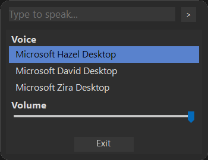

# Open Game TTS Overlay

    

This is an overlay that you run on your games that allows you to input text you wish to be TTS, the output is played back to you and also pushed through [VB-Audio Virtual Cable](https://vb-audio.com/Cable/) for the ability to talk through programs such as discord or used in games with voice proximity.

Uses Microsoft speech synthesis - Any language packs or SAPI5 voices you have installed on windows are available for you to use. If you want additional voices follow [this](https://support.microsoft.com/en-gb/topic/download-languages-and-voices-for-immersive-reader-read-mode-and-read-aloud-4c83a8d8-7486-42f7-8e46-2b0fdf753130) guide by Microsoft.

Early stages work in progess but it is fully functional, the code is just not very clean and the project layout needs some work along with a few extra features. Major refactor coming soon.

You must download [VB-Audio Virtual Cable](https://vb-audio.com/Cable/) for this to function.
