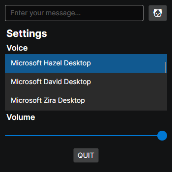

<br/>
<div align="center">
    
</div>

<h3 align="center">Open Game TTS</h3>
<p align="center">
    Generate TTS for use in voice proximity games, Discord, etc.
    <br/>
    <a href="https://github.com/kazaxc/OpenGameTTS/releases"><strong>Download Here</strong></a>
</p>


## About

Open Game TTS is an overlay that you run on your games that allows you to input text that you wish to be TTS, the output is played back to you and pushed through [VB-Audio Virtual Cable](https://vb-audio.com/Cable/) for the ability to talk through programs such as discord or used in games with voice proximity. The project is heavily inspired by Sea Of Thieves and R.E.P.O. which include a native TTS feature for their in-game chats, the idea is to make proximity chat games more accessible to those who do not use a microphone. 

<div align="center">
    
</div>

Uses Microsoft speech synthesis - Any language packs or SAPI5 voices you have installed on windows are available for you to use. If you want additional voices follow [this](https://support.microsoft.com/en-gb/topic/download-languages-and-voices-for-immersive-reader-read-mode-and-read-aloud-4c83a8d8-7486-42f7-8e46-2b0fdf753130) guide by Microsoft.

The project has been fully rewritten on [Avalonia](https://avaloniaui.net/) with an MVVM architecture, replacing the original Windows Forms prototype. All the original functionality carried over, along with a cleaner codebase and project layout. Check [milestones](https://github.com/kazaxc/OpenGameTTS/milestones) for progress on what's next.

### Built with

* [Avalonia](https://avaloniaui.net/)
* [CommunityToolkit.Mvvm](https://github.com/CommunityToolkit/dotnet)
* [NAudio](https://github.com/naudio/NAudio)
* [VB-Audio Virtual Cable](https://vb-audio.com/Cable/)
* [Microsoft Speech System](https://learn.microsoft.com/en-gb/previous-versions/windows/desktop/ms723627(v=vs.85))


## Getting started

### Prerequisits
You must download [VB-Audio Virtual Cable](https://vb-audio.com/Cable/) as this is how speech is transmitted to your desired outputs.

### Installation
1. Download the latest [latest release](https://github.com/kazaxc/OpenGameTTS/releases).

2. Set VB-Audio Virtual Cable as your input device on desired applications.

3. Run the executable and start typing, its that easy.

### Hotkeys
Focus on overlay:
    ```CTRL + ENTER```

Exit:
    ```ESC```

## Coming Soon
With the move to [Avalonia](https://avaloniaui.net/) complete, focus now shifts to new features such as persistant settings changes, hotkey rebinding and much more.
